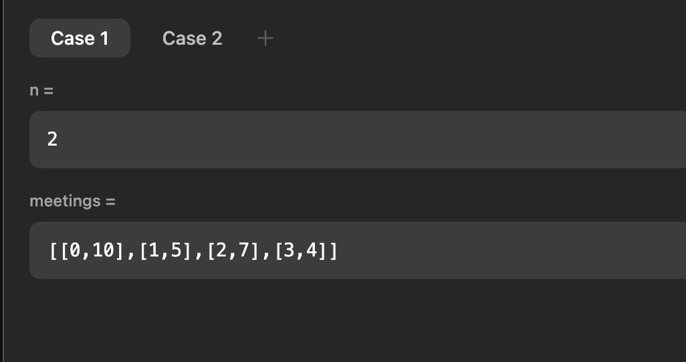
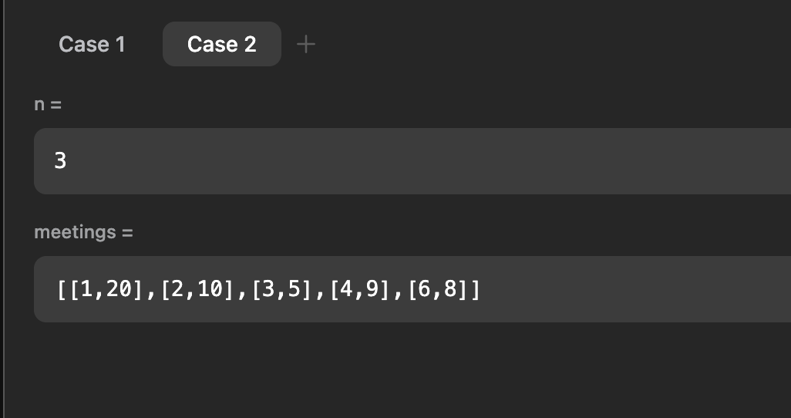
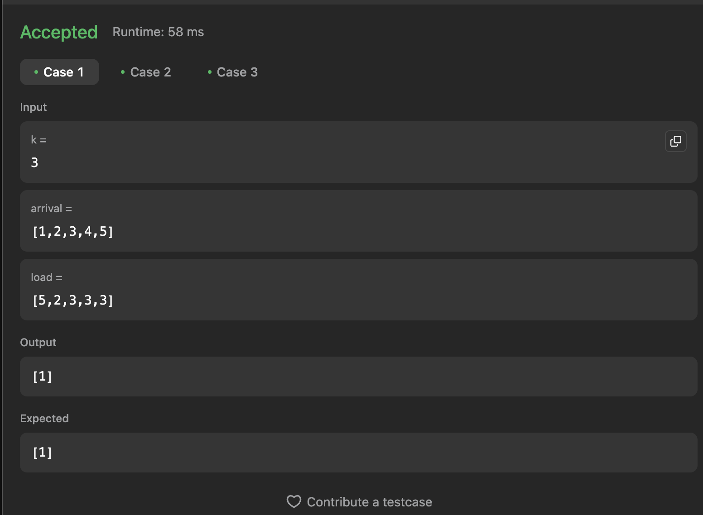
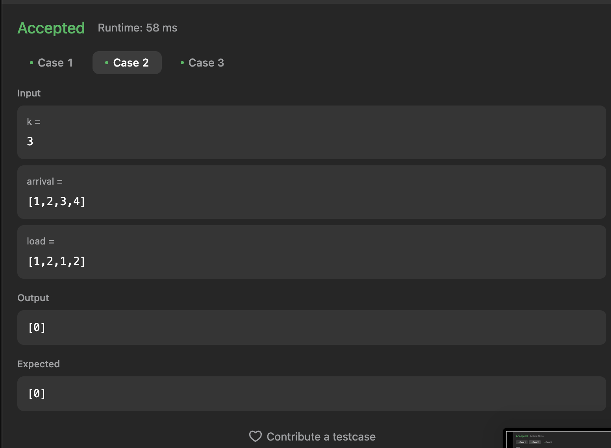
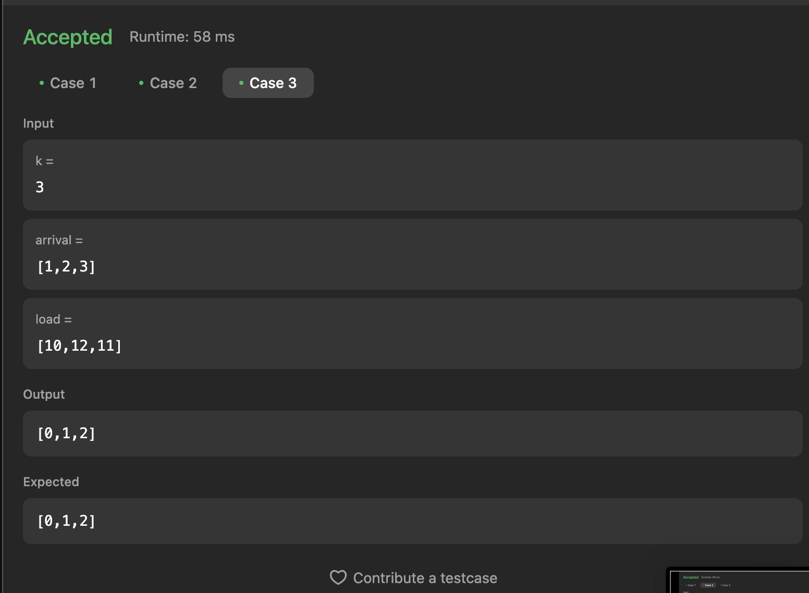

# Execícios do Leetcode

**Número da Lista**: 3<br>
**Conteúdo da Disciplina**: Algoritmos Ambiciosos<br>

## Alunos

- Dupla 6

| Matrícula | Aluno                             |
| --------- | --------------------------------- |
| 211061832 | Harleny Angéllica Araújo de Sousa |
| 211061331 | Alana Gabriele Amorim Silva       |

## Sobre

Este projeto tem como objetivo resolver questões do [LeetCode](https://leetcode.com/problemset/?search=graph&page=1&sorting=W3t9XQ%3D%3D) sobre grafos utilizando a linguagem de programação Python. Abaixo, estão listadas as questões selecionadas, com seus respectivos níveis de dificuldade e vídeos explicativos da resolução.

## Questões

| Nome                                                                                                                                        | Nível   |
| ------------------------------------------------------------------------------------------------------------------------------------------- | ------- |
| [630. Course Schedule III](https://leetcode.com/problems/course-schedule-iii/)                                                              | Difícil |
| [2402. Meeting Rooms III](https://leetcode.com/problems/meeting-rooms-iii/)                                                                 | Difícil |
| [1606. Find Servers That Handled Most Number of Requests](https://leetcode.com/problems/find-servers-that-handled-most-number-of-requests/) | Difícil |

## Vídeo

[Vídeo](https://youtu.be/LO1i9c0drQU)

## Screenshots

### [630. Course Schedule III](https://leetcode.com/problems/course-schedule-iii/)

Caso 1:

<br>

Caso 2:

<br>

Caso 3:

<br>

### [2402. Meeting Rooms III](https://leetcode.com/problems/meeting-rooms-iii/)

Caso 1:

<br>

Caso 2:

<br>

[1606. Find Servers That Handled Most Number of Requests](https://leetcode.com/problems/find-servers-that-handled-most-number-of-requests/)

Caso 1:

<br>

Caso 2:

<br>

Caso 3:

<br>

## Instalação

**Linguagem**: Python3 <br>

- Necessário ter o Python instalado.

## Uso

```
python3 "nome-do-arquivo"
```

## Outros

Quaisquer outras informações sobre seu projeto podem ser descritas abaixo.
